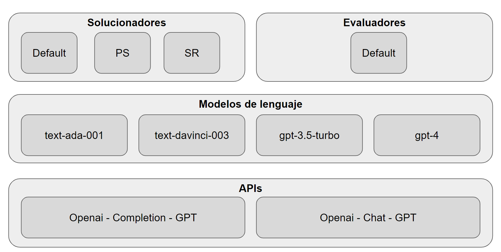

# Replicación de experimentos para PFC1 - UTEC
## Estudio de capacidades de razonamiento de modelos grandes de lenguaje según el prompt de entrada
### Autor: José Ignacio Huby Ochoa

### Ejecución

Ejecutar el siguiente comando para correr el programa:
```
python3 run.py
```

El programa pedirá los parámetros de entrada durante la ejecución.


### Estructura del código

A continuación, se puede ver una imagen de las capas de abstracción del código.

